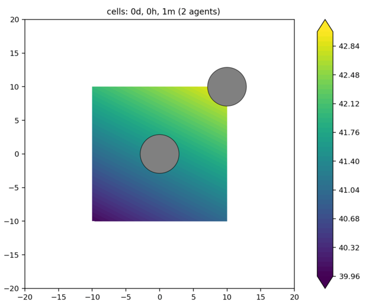

# test_pyMCDS

Background:
* [Mesh grid, cell location visualization - google doc](https://docs.google.com/document/d/1_YDrJGfflNe3pF4ch_ni16YvJWz_jemWJLShSqsymlw/edit?usp=sharing)
* http://www.mathcancer.org/blog/python-loader/
* http://www.mathcancer.org/blog/working-with-physicell-snapshots-in-matlab/

Clone this repo. Then in a Unix-based shell (although, note below that the repo is pre-populated with the output in /out_2x2):
```
cd test_pyMCDS/PhysiCell
make
test_pymcds config/config_2x2voxels.xml
```
This will generate output in the `out_2x2` directory. In fact, the repo is pre-populated with such output.

What's happening? The config_2x2voxels.xml defines a simple 2D domain: x: -20,20, y:-20,20, z:-10,10; dx=dy=dz=20. Therefore we have a 2x2 voxel domain. The config file only uses a .csv to provide cells' positions/types. The `custom.cpp` manually creates unique substrate values for each voxel: 40,41,42,43.

Therefore, the centers of the 4 voxels are: (-10,-10), (10,-10), (10,10), and (-10,10).

What's in the `initial.xml` file? Some relevant info is the following:
```
<microenvironment>
  <domain name="microenvironment">
    <mesh type="Cartesian" uniform="true" regular="true" units="micron">
     <bounding_box type="axis-aligned" units="micron">-20.000000 -20.000000 -10.000000 20.000000 20.000000 10.000000</bounding_box>
     <x_coordinates delimiter=" ">-10.000000 10.000000</x_coordinates>
     <y_coordinates delimiter=" ">-10.000000 10.000000</y_coordinates>
     <z_coordinates delimiter=" ">0.000000</z_coordinates>
```

If we try to use pyMCDS from the pip installed pcDataLoader to get the substrate concentration at (-10,-10,0), i.e., the center of the lower-left voxel, we get a runtime warning.
```
In [2]: from pcDataLoader import pyMCDS

In [3]: mcds = pyMCDS('output00000001.xml','.')
Reading output00000001.xml
Reading initial_mesh0.mat
Reading output00000001_microenvironment0.mat
Parsing substrate data
working on discrete cell data...

Reading output00000001_cells.mat

In [6]: cval = mcds.get_concentrations_at(x=-10, y=-10, z=0)
/Users/heiland/anaconda3_x86/lib/python3.9/site-packages/pcDataLoader/pyMCDS.py:112: RuntimeWarning: invalid value encountered in double_scalars
  dz = (Z.max() - Z.min()) / (Z.shape[0] - 1)
```
The reason for the runtime warning is because we're dividing by 0 which is never a good thing to do. The reason we're dividing by 0 hints at the confusion of this long-running, confusing, messy, headachy, time-wasting issue. Incredibly, there's still the question of whether or not we even want to fix it.

And if we try to use an experimental module, pyMCDS_rwh.py (copy from the root dir into /out_2x2), we get the expected voxel concentration value:
```
In [1]: from pyMCDS_rwh import pyMCDS

In [2]: mcds = pyMCDS('output00000001.xml','.')
_read_xml: self.bbox_coords=  [-20. -20. -10.  20.  20.  10.]

In [3]: mcds.get_concentrations_at(x=-10, y=-10, z=0)
/Users/heiland/git/test_pyMCDS/PhysiCell/out_2x2/pyMCDS_rwh.py:120: RuntimeWarning: invalid value encountered in double_scalars
  dz = (Z.max() - Z.min()) / (Z.shape[0] - 1)
get_containing_voxel_ijk: ds= 20
get_concentrations_at(): i,j,k= 0 0 0
get_concentrations_at(): concs[ix]= 40.0
Out[3]: array([40.])
```

Fun side note: our Matlab interface is now broken due to updates in our .xml output:
```
>> MCDS = read_MultiCellDS_xml('output00000000.xml','../out_2x2')
Unrecognized field name "basic_agents".

Error in read_MultiCellDS_xml (line 415)
                MAT = MAT.basic_agents; % use this instead of struct2array for better octave compatibility
```

What happens if we try to plot output, using the current version of the Studio?


